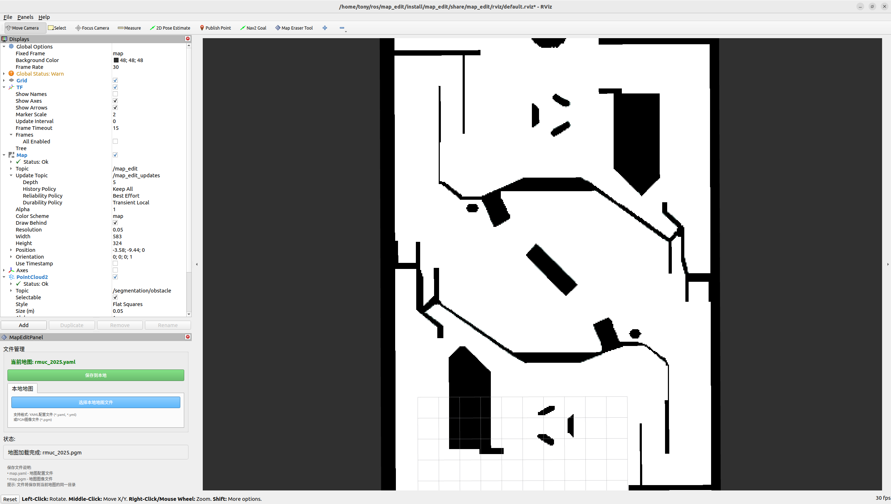
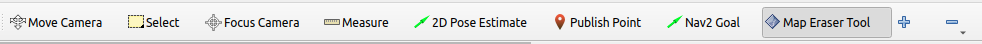

<!--
 * @Author: Tonytpc ykq31415926@163.com
 * @Date: 2025-07-09 22:24:31
 * @LastEditors: Tonytpc ykq31415926@163.com
 * @LastEditTime: 2025-08-05 12:22:05
 * @FilePath: /map_edit/readme.md
 * @Description: 这是默认设置,请设置`customMade`, 打开koroFileHeader查看配置 进行设置: https://github.com/OBKoro1/koro1FileHeader/wiki/%E9%85%8D%E7%BD%AE
-->
# ROS2 Map Edit Plugin
一个用于RViz的地图编辑插件，支持地图编辑功能。
> 本项目参考于 [ros_map_edit](https://gitee.com/reinovo/ros_map_edit) ，并做了Ros2兼容性修改。
> 演示视频：[map_edit地图编辑工具](https://www.bilibili.com/video/BV1XPtJzbEn8)




## 功能特点
- **🎯 告别 GIMP 手动像素换算的烦恼！ —— 一眼精确，点哪改哪！**
- **🧩 兼容 RViz 各类组件，直接获取障碍物点云 🔍 —— 修图不再盲修，修改更有“理”！**
- **🛠️ 边导航边修图，哨兵撞墙？马上改地图！ —— 实时修，边走边改，效率飙升！**
- **💾 一键保存为 .pgm + .yaml 文件 ✅ —— 操作简单，直接接入导航用！**


## 编译与运行


```zsh
mkdir -p ~/ros2_ws/src
cd ~/ros2_ws/src
git clone https://github.com/Tony-tpc/map_edit
cd ..
```

1. 安装依赖

    ```zsh
    rosdepc install -r --from-paths src --ignore-src --rosdistro $ROS_DISTRO -y
    ```

2. 编译

    ```zsh
    colcon build --symlink-install
    ```

3. 运行

    ```zsh
    . install/setup.bash
    ros2 launch map_edit mapeidt.launch.py 
    ```

## 使用说明

### 打开地图

#### 方式一：打开本地文件
1. 点击 `选择本地地图文件` 按钮
2. 选择`YAML` 对应的地图文件
3. 地图自动加载

#### 方式二：边导航边修图

1. 运行 `map_edit rviz` 插件
2. 运行其他导航节点
3. rviz自动获取/map话题，并显示地图
4. 此时即可根据导航节点的点云或导航效果修改地图


>[!NOTE]  
>修改后的地图发布在`/map_edit`话题下，并不会对导航产生影响，只有保存地图且导航节点重新加载pgm后才会生效

### 地图编辑： MapEraserTool - 黑白橡皮擦


>使用橡皮擦：左键画黑色，右键画白色

**快捷键说明：**
- ⬆️ / ⬇️：调整笔刷大小  
- **Ctrl + Z**：撤销上一步修改  
- **Shift + 左/右键**：画直线（起点-终点自动连接）  
### 地图保存

1. 点击 `保存到本地` 按钮
2. 选择保存路径
3. 自动补全 `pgm` 与 `yaml` 文件
4. 保存成功

## ✅ TODO List

- [x] 增加撤销功能(需优化)
- [x] 增加画直线功能
- [ ] 逐步实现 `gimp` 相关功能


